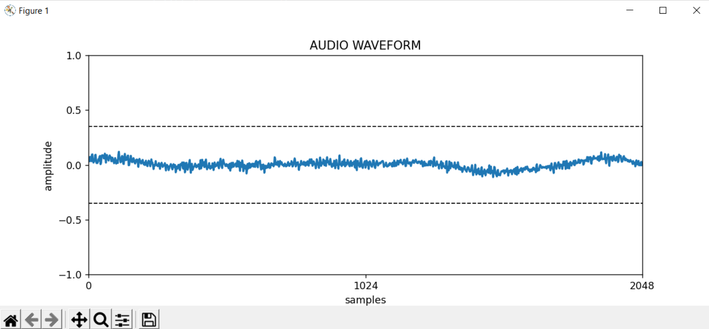

Generate Waveform from RTSP stream
==================================

This tool plot waveform data captured with ffmpeg in realtime by matplotlib and play the audio by ffpyplayer

**Requires:**
- Python 3
- NumPy
- Matplotlib
- ffmpeg
- ffpyplayer

